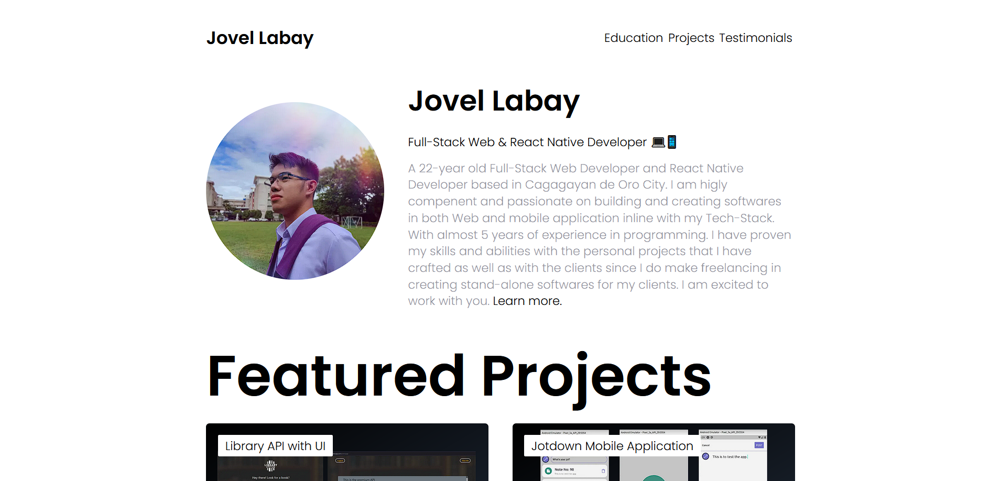

<!-- HELLO INTRODUCTION -->
<h1 align="center"> 👋 Hello </h1>

<!-- IMAGE FOR INTRODUCTION -->

  

<!-- INTRODUCTION STATEMENT -->
<h3 align="center">Full-Stack Web & React Native Developer 💻📱</h3>

  <samp>A 22-year old Full-Stack Web Developer and React Native Developer based in Cagagayan de Oro City. I am higly compenent and passionate on building and creating softwares in both Web and mobile application inline with my Tech-Stack. With almost 5 years of experience in programming. I have proven my skills and abilities with the personal projects that I have crafted as well as with the clients since I do make freelancing in creating stand-alone softwares for my clients.
  </samp>

<!-- CONTACT LINKS -->
<h3  align="center">📫Reach me on</h3>

    
    
    
    

<!-- PROGRAMMING LANGUAGES AND RUNTIME ENVIRONMENTS -->
<h3 align="center">Programming Languages | Runtime Environments</h3>

    
    
    
    
    
 

<!-- FRONTEND, BACKEND, API, AUTHENTICATION, TESTING, HOSTING TOOLS -->
<h3 align="center">Frontend | Backend | API | Authentication | Testing | Hosting</h3>

    &nbsp;&nbsp;&nbsp;&nbsp;
    &nbsp;&nbsp;&nbsp;&nbsp;
    &nbsp;&nbsp;&nbsp;&nbsp;
    &nbsp;&nbsp;&nbsp;&nbsp;
    &nbsp;&nbsp;&nbsp;&nbsp;
    &nbsp;&nbsp;&nbsp;&nbsp;
    &nbsp;&nbsp;&nbsp;&nbsp;
    &nbsp;&nbsp;&nbsp;&nbsp;
    &nbsp;&nbsp;&nbsp;&nbsp;  
    &nbsp;&nbsp;&nbsp;&nbsp;
    &nbsp;&nbsp;&nbsp;&nbsp;
    &nbsp;&nbsp;&nbsp;&nbsp;
    
    &nbsp;&nbsp;&nbsp;&nbsp;
    &nbsp;&nbsp;&nbsp;&nbsp;
    &nbsp;&nbsp;&nbsp;&nbsp;
    &nbsp;&nbsp;&nbsp;&nbsp;
    &nbsp;&nbsp;&nbsp;&nbsp;
    &nbsp;&nbsp;&nbsp;&nbsp;
    &nbsp;&nbsp;&nbsp;&nbsp;
    &nbsp;&nbsp;&nbsp;&nbsp;
    &nbsp;&nbsp;&nbsp;&nbsp;
    &nbsp;&nbsp;&nbsp;&nbsp;
    &nbsp;&nbsp;&nbsp;&nbsp;
    &nbsp;&nbsp;&nbsp;&nbsp;
    &nbsp;&nbsp;&nbsp;&nbsp;
    &nbsp;&nbsp;&nbsp;&nbsp;
    &nbsp;&nbsp;&nbsp;&nbsp;
    &nbsp;&nbsp;&nbsp;&nbsp;
    &nbsp;&nbsp;&nbsp;&nbsp;

